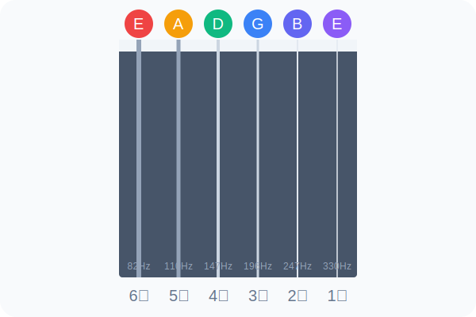

# 1-2 律动之泉：六弦调音

音准是音乐的生命线。在这一关，你将学习如何让六根琴弦回到它们原本的律动频率。

## 科学视角：标准音高 (Standard Tuning)

在物理学中，声音的频率以赫兹 (Hz) 表示。吉他标准调音的六根弦从粗到细（6弦到1弦）对应的频率大约是：

*   **6 弦 (E2)**: 82.41 Hz
*   **5 弦 (A2)**: 110.00 Hz
*   **4 弦 (D3)**: 146.83 Hz
*   **3 弦 (G3)**: 196.00 Hz
*   **2 弦 (B3)**: 246.94 Hz
*   **1 弦 (E4)**: 329.63 Hz

## 五线谱与弦名对照

## 关卡任务：调音口诀

为了方便记忆，我们使用口诀：**“一百个大阿姨”**。
(对应 1-6 弦从高到低：E B G D A E)

### 调音步骤：
1.  打开本系统的**[调音器](/tools)**。
2.  从最粗的 6 弦开始，拨动琴弦。
3.  观察屏幕：
    *   **指针偏左**：音低了，顺着琴弦方向拧紧弦钮。
    *   **指针偏右**：音高了，反方向拧松弦钮。
    *   **指针居中且变绿**：完美！

> **互动挑战**：请依次调准 6 根琴弦。

---

## 互动练习模块
本关卡关联练习：**[空弦音检测]**

**调准全部琴弦后，XP +200。**
