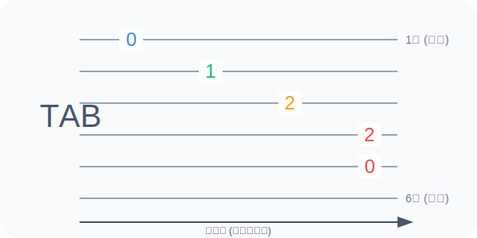

# 2-2 密语解读：六线谱基础

六线谱 (Tablature, 简称 TAB) 是专为吉他设计的可视化记谱法。它不记录音高，而是记录“手指放哪里”。

## 示意图：TAB 结构

TAB 将吉他的指板直接映射到纸面上。



*   **最上面的线**代表**1弦**（最细的弦）。
*   **最下面的线**代表**6弦**（最粗的弦）。

## 五线谱与六线谱对照

```text
    五线谱:  Do (C)  Re (D)  Mi (E)
    
    TAB:     |----------|----------|----0-----|
             |----------|----3-----|----------|
             |----0-----|----------|----------|
             |----------|----------|----------|
             |----------|----------|----------|
             |----------|----------|----------|
```

## 关卡要点：如何读谱

1.  **从左往右读**：时间轴是从左向右延伸的。
2.  **垂直重叠**：如果数字在同一垂直线上，代表它们需要**同时弹响**。
3.  **数字 0**：代表拨动该弦的空弦音（左手不按弦）。

---

**解开了六线谱的秘密，你就拥有了阅读无限乐谱的能力，XP +150。**
